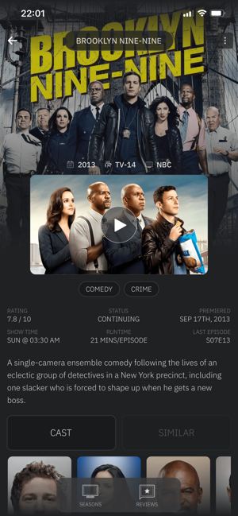
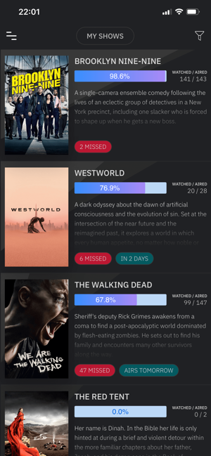
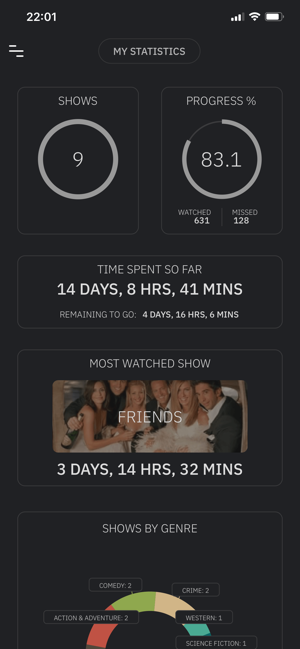
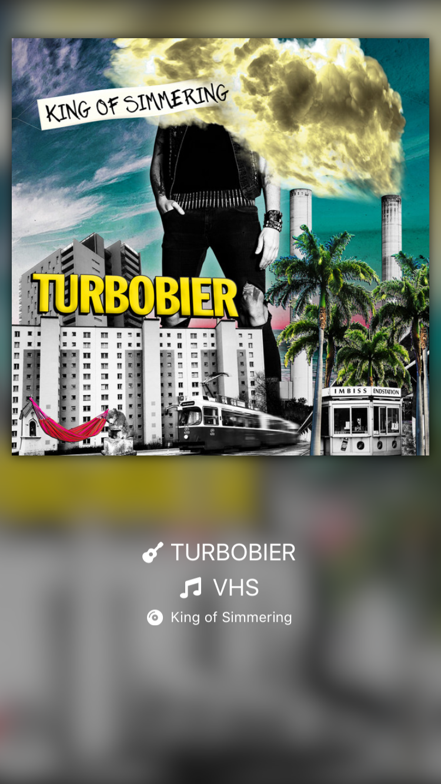
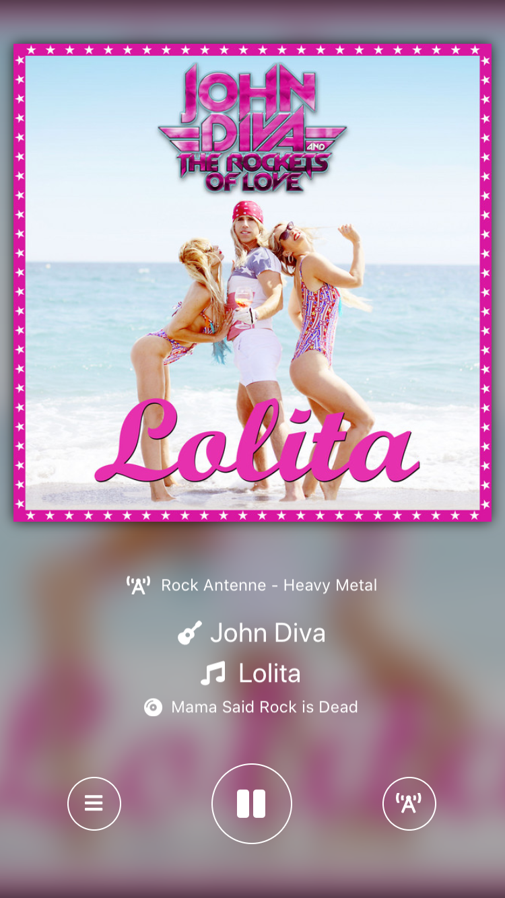
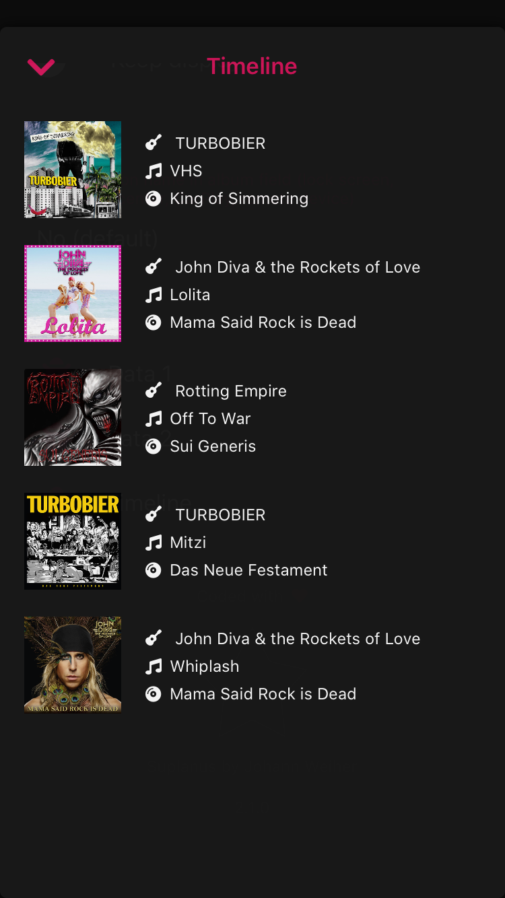
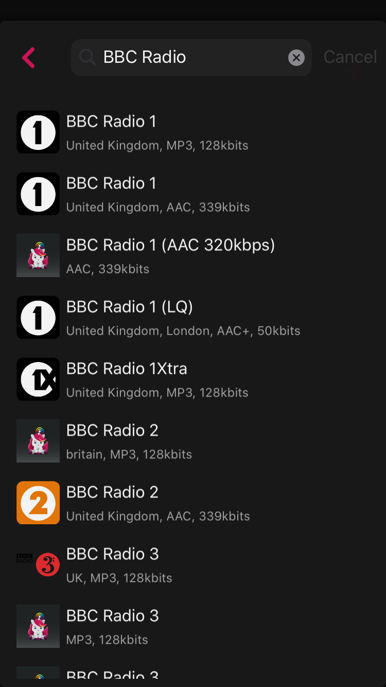

# Xamarin.Forms goodlooking UI Apps 

A curated list of awesome **goodlooking UI** published apps made with Xamarin.Forms.

*Work in progress*. Contributions are always welcome!

## Series Watchlist

Your gateway to the world of thousands of TV shows. Keep updated with latest, upcoming and trending series, search for TV shows, watch trailers, keep track of the shows you want to watch.

   

### Platforms

Android, iOS.
  
### More information:
- [Google Play](https://play.google.com/store/apps/details?id=com.xgeno.serieswatchlist)
- [App Store](https://apps.apple.com/us/app/series-watchlist/id1314148730)

## Cuterdio - Internet Radio

Cuterdio is the perfect app if you love music. Lean back and remember the good old times of sitting in a dark room and looking at the artwork of your favorite band.
Simple choose your radio stations and listen to them with few taps. The artist, track, album with cover is displayed in a beautiful and clean user interface.

Features:
- Coverart
- Album information
- CarPlay
- Show in Apple Music
- Show in Spotify
- Show in Wikipedia
- Show fullscreen cover
- Big radio station database with more than 25.000 entries
- Timeline of last played songs
- No Ads
- No login / registration

        

### Platforms
- iOS
- macOS
  
### More information:
- [App Store](https://apps.apple.com/de/app/cuterdio-internet-radio-app/id1489513385)
- [Website](https://cuterdio.com)