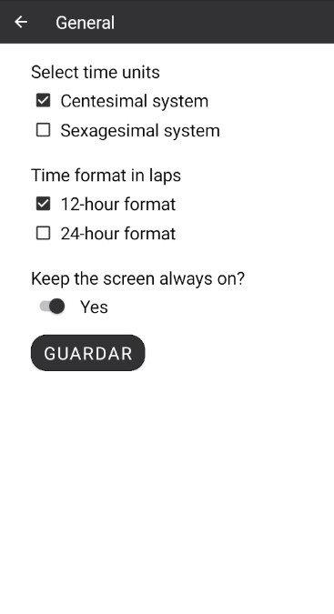

# Xamarin.Forms goodlooking UI Apps 

A curated list of awesome **goodlooking UI** published apps made with Xamarin.Forms.

*Work in progress*. Contributions are always welcome!

## Series Watchlist

Your gateway to the world of thousands of TV shows. Keep updated with latest, upcoming and trending series, search for TV shows, watch trailers, keep track of the shows you want to watch.

   

### Platforms

Android, iOS.
  
### More information:
- [Google Play](https://play.google.com/store/apps/details?id=com.xgeno.serieswatchlist)
- [App Store](https://apps.apple.com/us/app/series-watchlist/id1314148730)

## Centesimal Stopwatch

The Centesimal Stopwatch application allows to measure the time in system centesimal and sexagesimal, you can register unlimited laps.

   

### Most relevant tools
- [Vungle](https://github.com/gregthatcher/VungleXamarinDemo) to display ads in UWP.
- [GooglePlayServicesComponents](https://github.com/xamarin/GooglePlayServicesComponents/) to display ads in Android.
- [Xamarin.Essentials](https://github.com/xamarin/Essentials)
- [SQLite-net](https://github.com/praeclarum/sqlite-net)
- [Microsoft.AppCenter](https://appcenter.ms/)

### Platforms

Android, Windows.
### More information:
- [Google Play](https://play.google.com/store/apps/details?id=com.centesimalstopwatch)
- [Microsoft Store](https://www.microsoft.com/en-us/p/centesimal-stopwatch/9ngqzn36vz1t?activetab=pivot:overviewtab)
